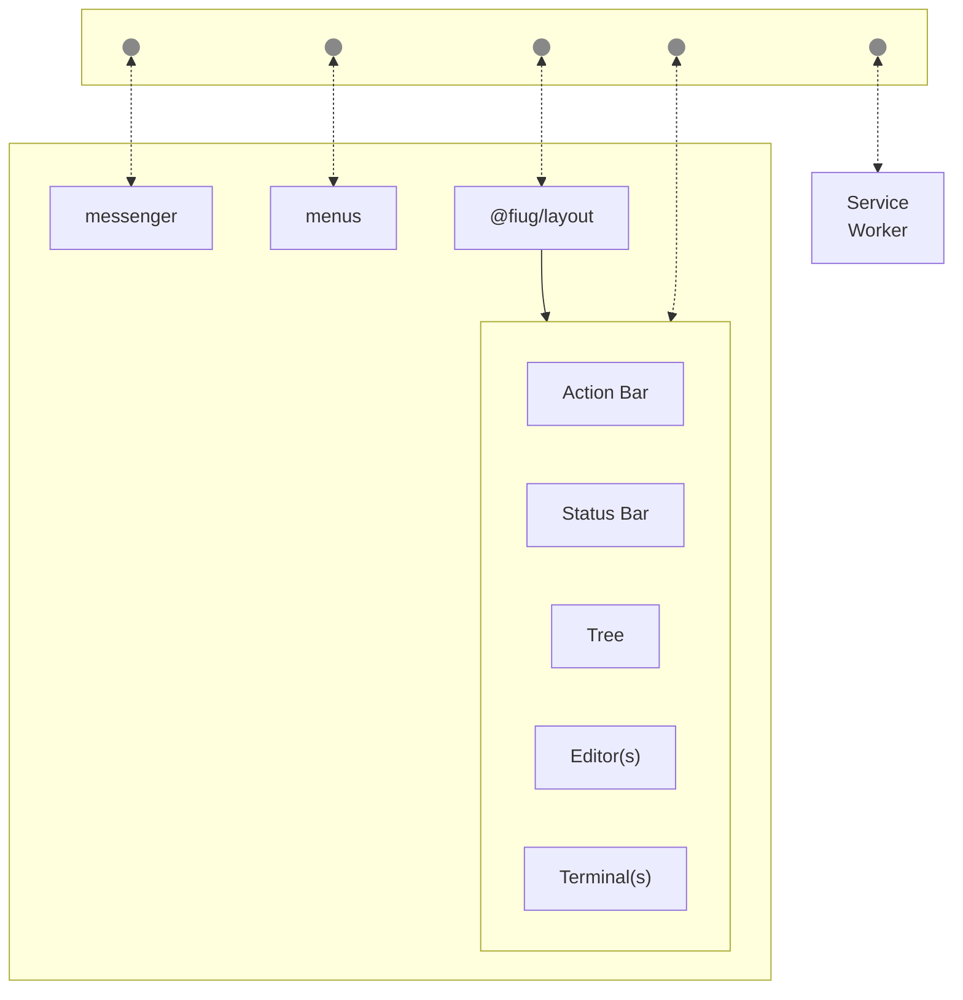

## TODO
- [ ] use module param when splitting pane
- [ ] get tree/search buttons working correctly
- [ ] differentiate between `repoOne/file.md` and `repoTwo/file.md`
- [ ] hotkeys
- [ ] command palette & file select palette
- [ ] settings icon + menu
	- fullscreen triggers from menu(page) context
	- action bar: settings icon -> menu -> fullscreen

- [ ] hide/customize explorer menu/actions
- [ ] close tabs en masse
- [ ] mobile view

- [ ] create build for /dist/index
	- would include all the modules that load on main page
	- would not include modules that load in a frame
- [ ] uml in markdown preview [codeblocks](https://github.com/Bloggify/showdown-highlight)
- [ ] github flavored markdown (in markdown preview)

- [X] use editor service params in layout
- [X] `editor.html?file="foo.md"&service="user/repo"&line=23&column=0`
- [X] search pane
- [X] menus need to appear at the correct spot
	- iframe where click occured should share its pane id
	- or event should be sent through layout module
- [X] operations
	- wired up to service worker (in general)
	- save/load layout config using service worker
	- respond to fileDelete/fileClose
	- respond to (acks) terminal's fileOpen operation event
- [X] explorer tabs customize
- [X] terminal tabs (hide)
- [X] programmatically change tabs
- [X] editor should no longer handle tabs
	- ie. `Could not find a tab named .test.html to update`
	- at least should tolerate tabs not existing
- [X] action bar
- [X] status bar
- [X] menus

## why layout module?, or why 0.4.6?
- need side-by-side editor
- need "close all tabs" or "close other tabs" or "close tabs to the right"
- need "preview close" in terminal status bar
- need "each editor has its own status bar" or "fiug status bar is different"
- need "each pane is its own thing"
- need "open editors" and option to turn off tabs?

## frame communication
[comlink](https://github.com/GoogleChromeLabs/comlink)   
[comlink experiment](https://github.com/fiugd/incubator/tree/d44c82640df1a2175c236a0c7dc55a0f082059f1/xterm-tui/comlink)   
[postmate](https://github.com/dollarshaveclub/postmate)   
[zoid](https://github.com/krakenjs/zoid)   
[post-me](https://github.com/alesgenova/post-me)   
[broadcast-channel](https://github.com/pubkey/broadcast-channel)   
[Broadcast Channel Browser API](https://caniuse.com/broadcastchannel)   

- [ ] Decide on a messenger module to use for bus.
- [ ] Connect panes in layout to bus.
- [ ] One service should send/receive messages from service worker.

## FIUG Architecture

