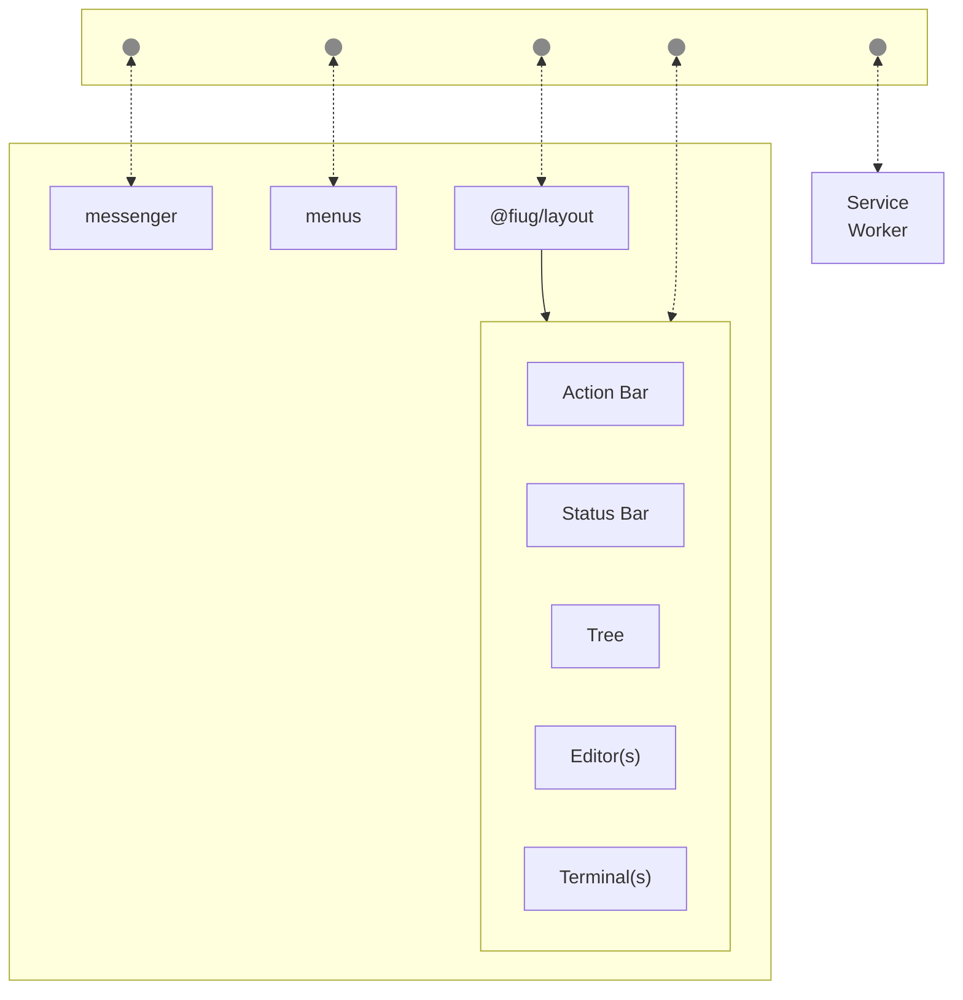

# TODO
- [X] action bar
- [X] status bar
- [X] menus
- [ ] menus need to appear at the correct spot
	- iframe where click occured should share its pane id
	- or event should be sent through layout module
- [ ] settings icon + menu
	- fullscreen triggers from menu(page) context
	- action bar: settings icon -> menu -> fullscreen
- [ ] editor should no longer handle tabs
- [ ] wired up to service worker
- [ ] operations
	- respond to fileDelete/fileClose
	- respond to (acks) terminal's fileOpen operation event
- [ ] create build for /dist/layout (or for fiug page in general)
- [ ] handle hotkeys

## frame communication
[comlink](https://github.com/GoogleChromeLabs/comlink)   
[comlink experiment](https://github.com/fiugd/incubator/tree/d44c82640df1a2175c236a0c7dc55a0f082059f1/xterm-tui/comlink)   
[postmate](https://github.com/dollarshaveclub/postmate)   
[zoid](https://github.com/krakenjs/zoid)   
[post-me](https://github.com/alesgenova/post-me)   
[broadcast-channel](https://github.com/pubkey/broadcast-channel)   
[Broadcast Channel Browser API](https://caniuse.com/broadcastchannel)   

- [ ] Decide on a messenger module to use for bus.
- [ ] Connect panes in layout to bus.
- [ ] One service should send/receive messages from service worker.

### FIUG Architecture

